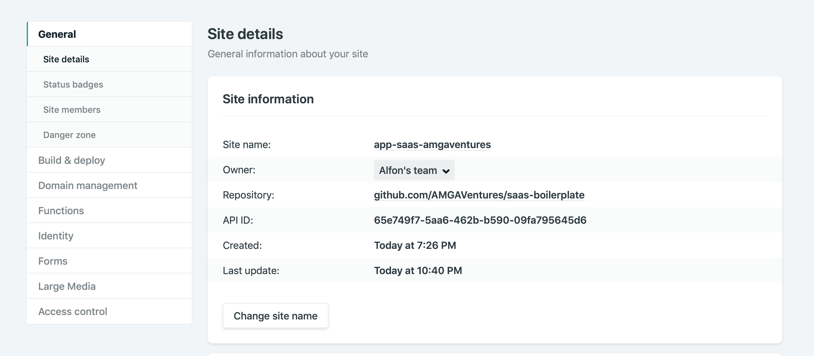
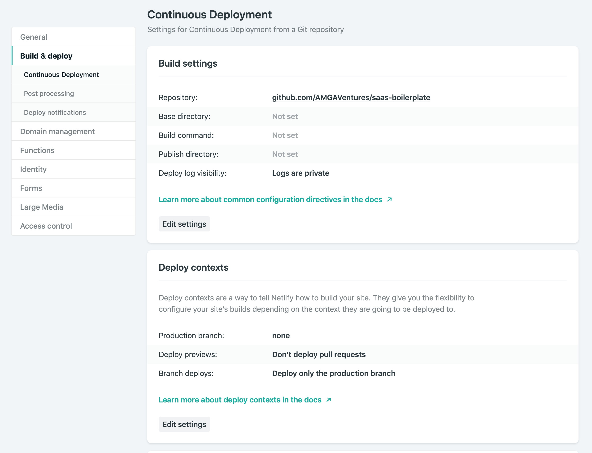
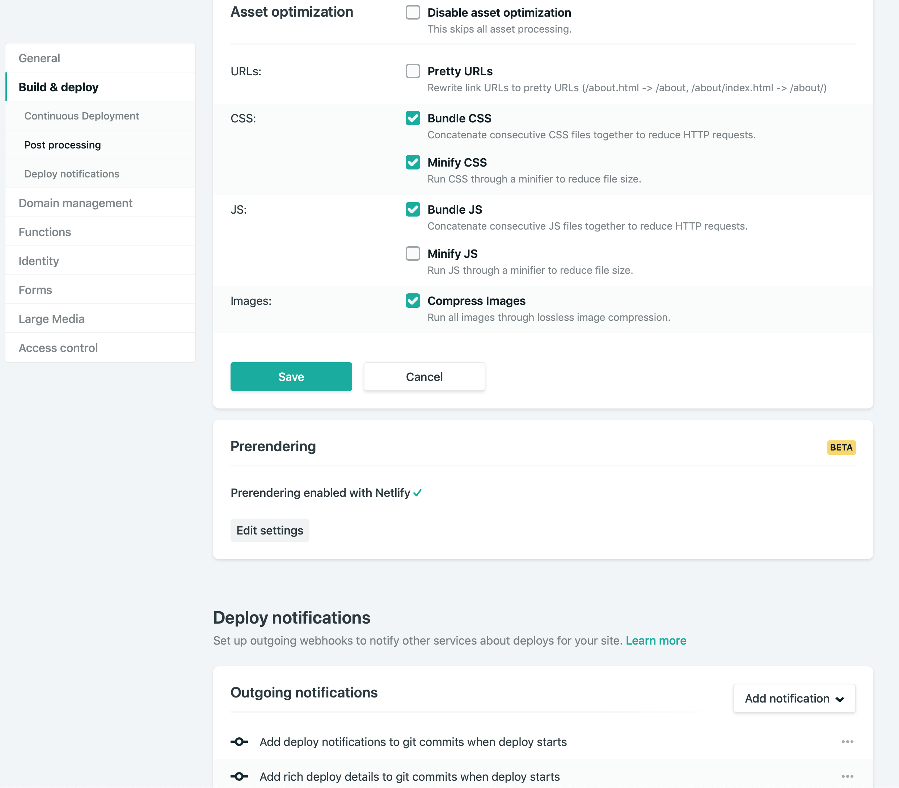
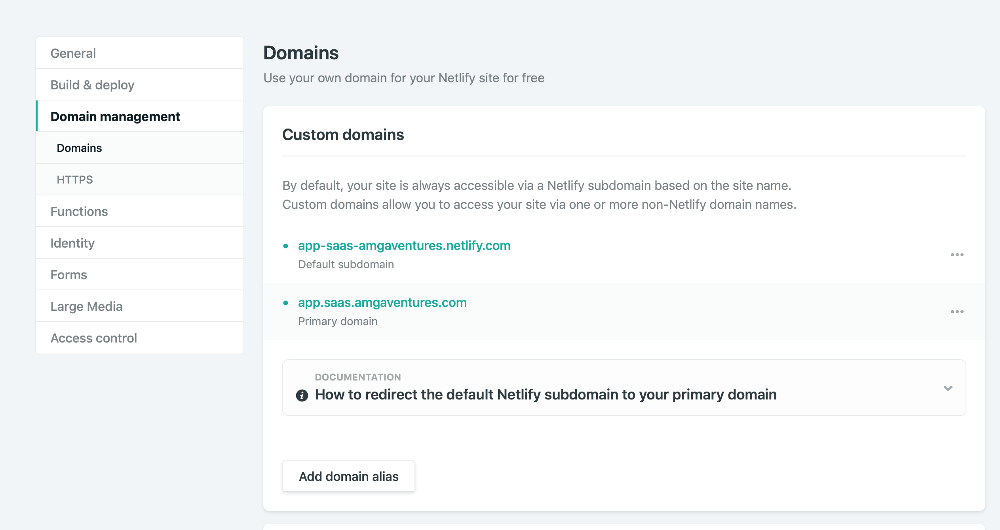
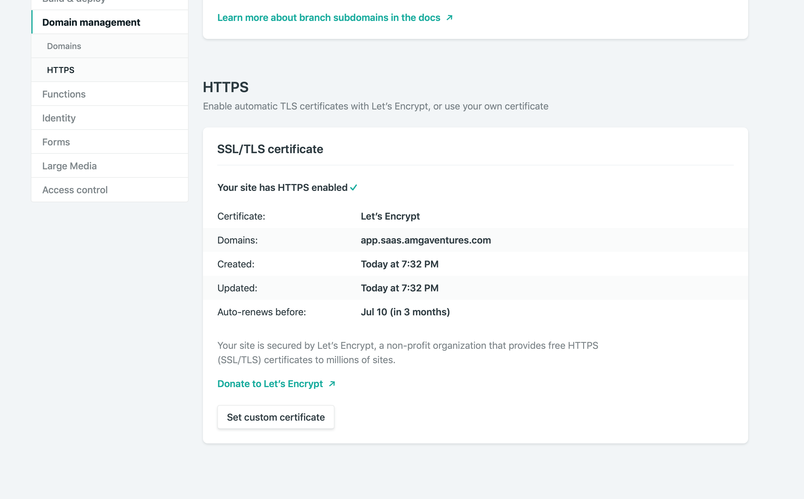
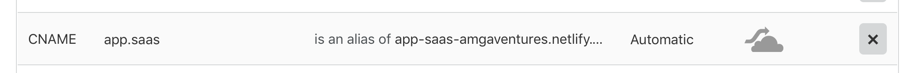

# Netlify setup

Website: <https://www.netlify.com>.

## Requirements

- Generate `Personal access token` (URL: <https://app.netlify.com/account/applications>) to add it as `secret` to our Drone.io system.
- We'll need each site `API ID` (Site settings -> Site details) to publish deploys.

## Screenshots (example config for each site)

### General

### Build & deploy

### Domain management

### Cloudflare DNS

