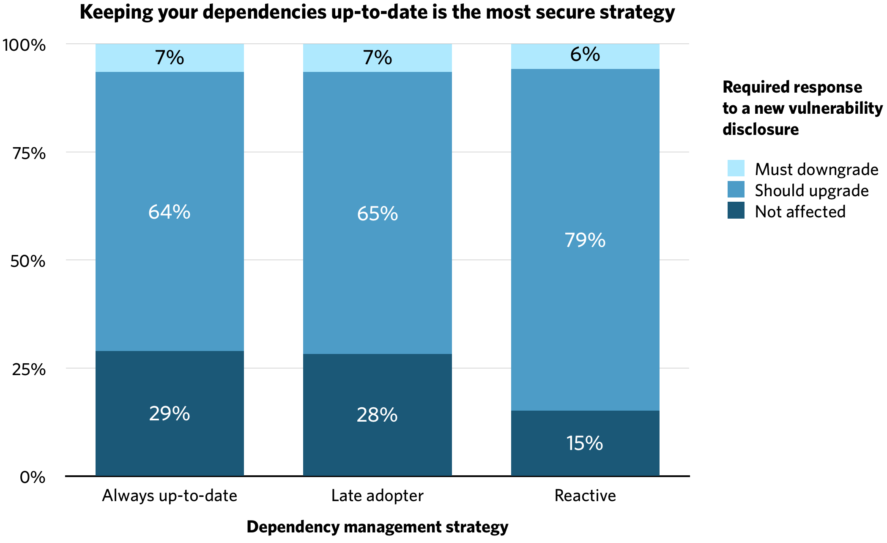

Want to keep your application as secure as possible? According to the last 10 years of Rubysec data, the most secure, actionable strategy is to keep your dependencies on the bleeding edge.

### Competing strategies

Let’s consider three competing strategies for dependency management:

1. **Always up-to-date:** Use the latest version at all times. _“It may be raw, but I want the fixes and new features as soon as possible.”_
2. **Late adopter:** Wait a month before upgrading to new major or minor versions (except for security vulnerabilities). _“Older versions are tried and tested.”_
3. **Reactive:** Upgrade as-and-when there’s a security vulnerability or business need. _“Proactive dependency management is busy-work.”_

I’ve heard arguments made for all three of the above. Let’s confront them with the data.

### The data

Thanks to the fine folk at [Rubysec][rubysec] we can do better than just arguing about the security of the above strategies. The [Ruby Advisory Database][ruby-advisory-db] gives us 10 years worth of Ruby vulnerability disclosure data. Combining that with the [Rubygems API][rubygems-api] for gem versions gives us all the data we need to test each strategy’s security profile.

### The methodology

We’ll profile the position each strategy puts us in on the day of a vulnerability disclosure. For each strategy we’ll calculate:

- The probability our version isn’t affected
- The probability our version can be fixed by updating same-day
- The probability our version can only be fixed by downgrading
- The probability no fix exists on day zero (same for all options)

First up, we need to rigorously define each strategy:

1. **Always up-to-date:** Always on the latest version the day _before_ a security vulnerability is disclosed. (For fairness, we assume they are one day behind on the day that the vulnerability is disclosed.)
2. **Late adopter:** Tracks the latest minor version that has been out for at least a month. Always on the latest patch release of this version
3. **Reactive:** Equally likely to have added or updated the dependency at any time in the year preceding the vulnerability disclosure. Used the latest version of the dependency when they did

Combining the above with Rubysec’s advisories database and Rubygems’ versions API, we’ve got everything we need.

### The code

We've [open-sourced][jupyter-notebook] the code to replicate all of the results below. The code is heavily commented, so anybody should be able to follow along. The repo contains full setup instructions and a Dockerfile to make it easy to get up and running. If you want to experiment with the data, we'd love to hear what you find.

### The results

|                    | Always up-to-date | Late adopter | Reactive |
|--------------------|-------------------|--------------|----------|
| Not affected       | 16%               | 15%          | 8%       |
| Fix by upgrading   | 34%               | 35%          | 43%      |
| Fix by downgrading | 3%                | 3%           | 3%       |
| No fix on day zero | 47%               | 47%          | 47%      |

First up, let’s quickly talk about that 47% “no fix” number. Nearly half the dependency vulnerabilities considered didn’t have a patched or unaffected version available on the day of disclosure. Ouch. A bit more digging shows that number falling to 32% a month after disclosure, and eventually as low as 21%. Almost all the affected dependencies are unmaintained, which goes a long way to explaining it.

Next up, the strategies. Here’s how they perform after rebasing to remove the shared “no fix available” number:

{:class="img-responsive"}

The “always up-to-date” and “late adopter” strategies perform almost identically---the “always up-to-date” strategy is marginally less likely to be affected by a new vulnerability, but with only a small data set they’re statistically inseparable.

However, consider the ease with which an “always up-to-date” user can apply a new security patch on day zero, which is almost always the required response. The delta in that patch will likely only contain the security change, whereas the “late adopter” often has to upgrade a major or minor version (or backport the patch themselves).

**Put another way, if your dependencies are totally up-to-date you’re just as secure as someone pursuing a late adopter strategy, but have the additional advantage that you can respond to new disclosures more easily.**

Finally, it's surprising to see the “reactive” strategy perform so badly. It’s twice as likely to be vulnerable as the “always up-to-date” strategy, and the “fix by upgrading” flow is likely to be just as difficult as for the “late adopter”.

### Nice data, so what should I do about it?

I’m so glad you asked. As luck would have it, we’ve spent the last few months building [Dependabot][dependabot]. It’ll make keeping your dependencies up-to-date a breeze, and by extension help you keep your app secure.

You’re welcome :-)

[rubysec]: https://rubysec.com/
[ruby-advisory-db]: https://github.com/rubysec/ruby-advisory-db
[rubygems-api]: http://guides.rubygems.org/rubygems-org-api/#gem-version-methods
[jupyter-notebook]: https://github.com/dependabot/gem-vulnerability-analysis/blob/master/notebooks/vulnerability-analysis.ipynb
[dependabot]: https://dependabot.com/

