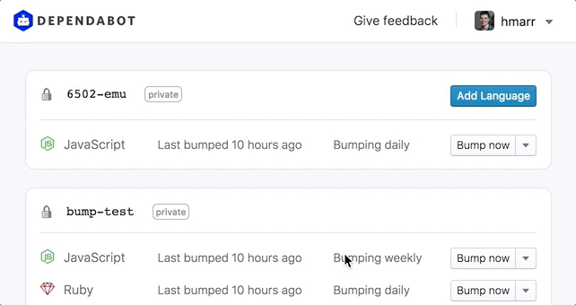

We just shipped a handy little new feature: the ability to reduce the frequency
of dependency updating from daily to weekly.

Daily updates will remain as the default option---hearing about new versions
sooner rather than later is always preferred. However, for projects that have a
lot of dependencies that are often updated, weekly updating may suit you
better.

If you do decided to use weekly bumping, it might be worth checking out services
like [Snyk][snyk] to ensure you still hear about vulnerabilities promptly.

  

Thanks to Stuart Harrison for [suggesting][issue] this improvement! We love
hearing your feedback, so [keep it coming][feedback].

[snyk]: https://snyk.io/
[issue]: https://github.com/dependabot/feedback/issues/2
[feedback]: https://github.com/dependabot/feedback/issues
