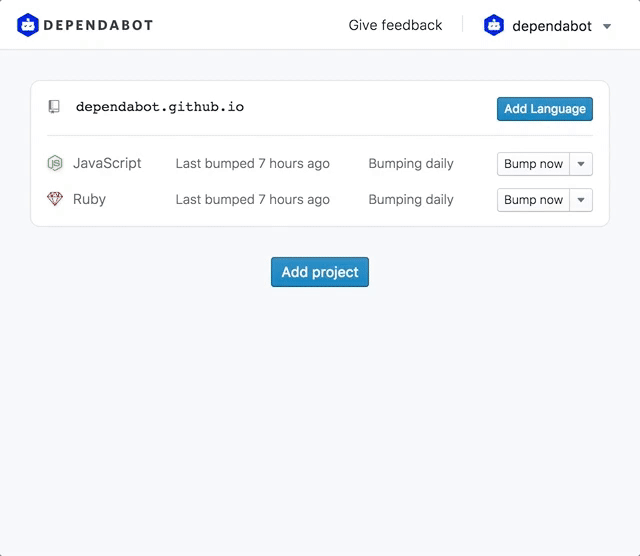

Using PHP? Dependabot now works with Composer to automate keeping your packages
up-to-date.

To get started, just click the "Add project" button and select the PHP repo
you'd like to automate updates for. We'll automatically detect its language.
Click "Add" and you're all done---Dependabot will check for updates for you
every day, and create PRs when it finds any.

  

Thanks to Pete Hamilton for all his work on this improvement!
