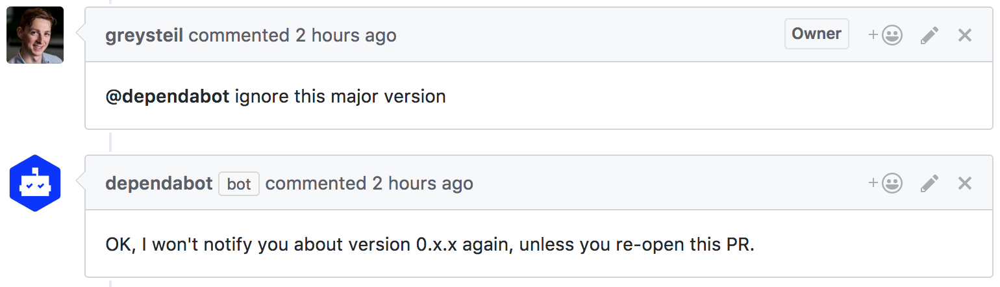

We just shipped a handy new feature: you can now ask Dependabot to ignore a
major or minor version of a dependency.

Say you're using React Router 3.x, and know the upgrade path to 4.x isn't
straightforward. You'd love to do the work, but just can't prioritise it right
now.

Previously, Dependabot would troll you every time a new 4.x release came out.
We liked to call it reminding, but let's be honest. Specifying a version
constraint in your package.json wouldn't help either - Dependabot would just
bump that constraint for you, too.

Now, when you close a PR, Dependabot will give you the option to ignore that
major/minor version.

The above is our solution to "the Gemfile problem": how, or whether, Dependabot
should interpret constraints in a project's manifest file. Now that you can
easily tell Dependabot to ignore a dependency version instead, we hope that
thorny issue goes away. 🤞

Thanks to Marcelo Alves for the [tweet][alves-tweet] that helped lead to
this improvement. We love hearing your feedback, so [keep it coming][feedback].

[alves-tweet]: https://twitter.com/celo_fett/status/907316211771305984
[feedback]: https://github.com/dependabot/feedback/issues
