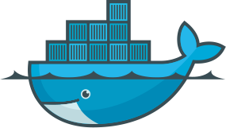

Using Docker? Dependabot can now help you keep your base image up-to-date.

  

Here's how it works:
- Dependabot looks for a "Dockerfile" in your repo, and pulls it down
- Dependabot extracts the tag from the `FROM` line in your Dockerfile, and
  checks whether it's the latest version available from Docker Hub
- If there's an update available, Dependabot updates the `FROM` line in your
  Dockerfile and creates a PR for you

As you can see the above is pretty basic - it just updates the base image,
rather than attempting to update the packages in your container. That said,
we hope it will at least serve as a helpful reminder when new images are
released.

We wanted to launch Docker support as early as possible, so have released it
in beta. As such, we currently **don't** support the following:
- **Private Docker registries.** ~~We want to add support for these as soon as
  possible, but it requires some extra work on our side. (We'll need to give
  you a place to enter your Docker credentials.)~~ Update (24th October 2017):
  Dependabot now supports private Docker registries! 🎉
- **Digests**. ~~Currently, Dependabot will only update images that specify a
  tag. In future, we'd like to be able to support Dockerfiles that specify a
  digest for their base image.~~ Update (12th October 2017): Dependabot now
  supports digests! 🎉
- **Non-numeric tags**. ~~Currently, Dependabot will only update tags like
  `17.04`. In future, we'd like to support updating tags like `3.6.1-slim` to
  `3.6.3-slim`, too. We'll probably never support updating tags like `zesty`,
  though.~~ Update (21st October 2017): Dependabot now supports tags like
  `3.6.1-slim`! 🎉

To get started, just click the "Add project" button and select the repo
you'd like to automate updates for. Select "Docker" from the list of
languages, and click "Add".
