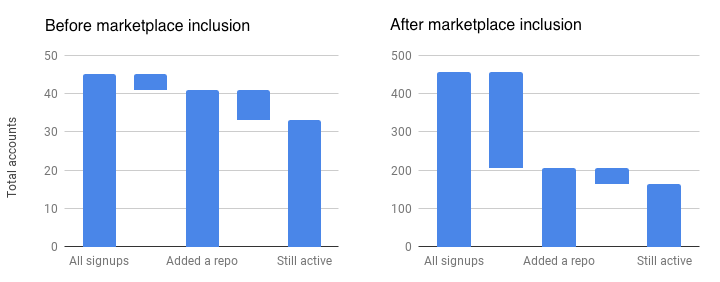
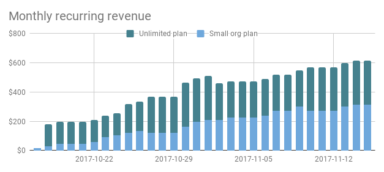
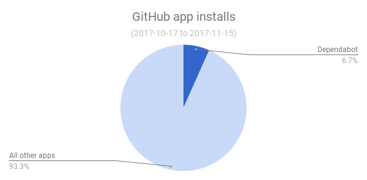

It's been a month since Dependabot was added to the
[GitHub Marketplace][marketplace]. Time to crunch some numbers on the effect
it's had.

### GitHub Marketplace drives a lot of signups

It's not hard to guess when Dependabot went into the GitHub Marketplace from the
graph above. In the previous month we had 45 signups, in the subsequent one we
had 457. **That's literally a 10x increase!**

### Around half those signups are good quality

Unsurprising, not all of those new signups are as high-value as the ones that
sought Dependabot out before it were part of GitHub Marketplace. To actually try
Dependabot you need to install it on a repo from our UI. That only takes
about 3 clicks, but post-marketplace 55% of people didn't manage it.

The good news, however, is that **the quality of signups who do add a repo
hasn't changed** from before Dependabot was in the Marketplace.
Around 80% of them continue to use the service (in our experience indefinitely).

As an aside, many of the accounts that never added a repo appear to be fake
users. I have no idea what their motivation is, but we see signups from "users"
who only signed up for GitHub moments beforehand, and have completely
unintelligible handles.

### They're willing to pay

Dependabot doesn't charge personal accounts at all, and only charges
organisations for private repos. As such, **we don't expect most people to ever
pay us** but we do hope they'll evangelise us.

Further, we do no sales or marketing. We don't sponsor anything, don't do PPC,
and don't send cold emails. All we do is build a great product.

Despite that, we've not only seen increased signup numbers from GitHub
Marketplace, but real revenue. Almost every day, a new organisation finds us and
starts paying for the service. In almost every case we've had no previous
contact with them.

### It's working for other apps, too (we think)

GitHub uses integer IDs for app installations, so we can calculate how many app
installs occurred in a given period. From that, we can tell what percentage of
app installs were Dependabot.

That 7% number looks great, but it probably overstates Dependabot's share of
Marketplace installs. Whilst Dependabot is 7% of all *App* installs, that
doesn't include *OAuth* installs, which some of the big-name members of the
Marketplace still use.

### Conclusion: GitHub Marketplace is a great distribution channel

For a simple, low-cost product that requires very little setup the GitHub
Marketplace is a great distribution channel. It's driven a lot of high quality
signups to us, many of whom have evangelised us to organisations who now pay us.

If you're building a developer tool that can operate a similar model then we
can't recommend GitHub Marketplace highly enough!

[dependabot]: https://dependabot.com
[marketplace]: https://github.com/marketplace
