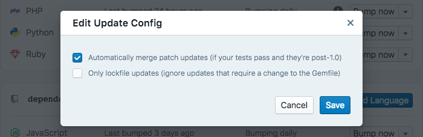
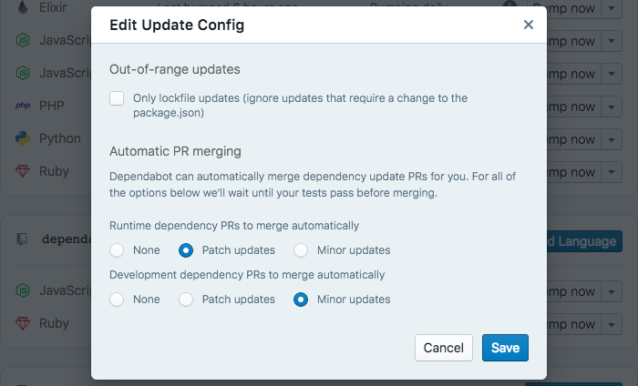

Dependabot can now automatically merge patch-level updates for you. It's a beta
feature, and we'd love your feedback on it.

  

We see auto-merging as a bit of an experiment. We're not yet sure exactly when
it's a good idea, but are certain it has a role to play.

For now, if you ask Dependabot to automatically merge PRs it will merge
patch-level updates where the dependency is post-1.0 and your tests are passing.
Pull requests will be created as normal, and merged shortly afterwards.

In future, we imagine making the above settings customisable. We think you might
want to auto-merge only development dependencies, in-range updates, or
dependencies with a certain compatibility score, for example.

We'd love your thoughts as we develop auto-merging further -
[get in touch][feedback-link]!

🍸

**Update 2018-03-06:** We're already expanded the options for automerging! You
can now select different settings for development and runtime dependencies:

  

[feedback-link]: https://github.com/dependabot/feedback
