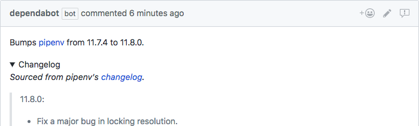

We've overhauled Dependabot's pull requests to include changelogs, release notes
and commit details. Here's an [example][example-pr].

  

We're always looking to improve Dependabot, and when the folks from GOV.UK
suggested we pull the changelog and release notes into our PRs we knew it was a
good suggestion.

Making the above happen requires a few tricks, and we had an
[embarassing experience][ava-pr] accidentally @mentioning the ava team. We
think it's worth it, though. Let us know if you ever spot anything amiss and
we'll fix it straight away.

🍸

[example-pr]: https://github.com/y-yagi/travel_base/pull/467
[ava-pr]: https://github.com/y1ngyang/bigfive-web/pull/10
