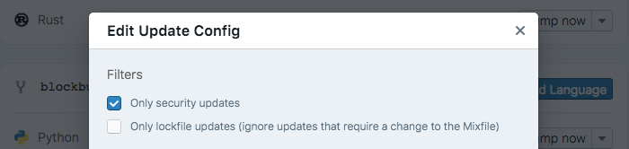

You can now set Dependabot to only create PRs in response to security
advisories.

  

As [announced last week][security-announcement], Dependabot now automatically
responds to security advisories in Ruby, PHP, Rust and Elixir dependencies
(more languages coming soon). When a new vulnerability is disclosed it will
immediately create a PR to update you to a patched version.

We want everyone to be able to benefit from the above, regardless of their wider
dependency management strategy. To make that possible, Dependabot can now be
set up to only create PRs for security updates.

To configure a repo for security updates only, click "show advanced options"
when adding it to Dependabot, or click to edit it once it's been added.

Stay safe out there!

🍸

[security-announcement]: ../automatically-respond-to-security-advisories
