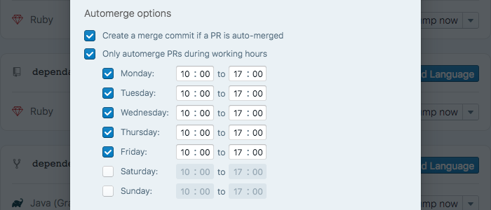

You can now specify "working hours" for Dependabot's automerge functionality. 🤖

  

We added the option to [automerge Dependabot PRs][automerge-announcement] back
in March. It's been a big success - 10% of repos using Dependabot now have some
form of automerging enabled.

Previously if automerging was enabled Dependabot would merge PRs as soon as CI
passed on them. Now you can specify working hours for Dependabot to do the
merges in. We hope it will allow even more people to benefit from automerging.

To make the above work, we've also made Dependabot fully timezone aware. You can
now specify a timezone in your settings, rather than using UTC for everything
(although UTC is always an option):

  

Finally, we'd like the thank [@appltn][andy-twitter] for his feedback on
restricting merges to working hours. If you ever have any feedback, or if you
experience any issues, please don't hesitate to [let us know][feedback-link]!

🍸

[automerge-announcement]: ../automatic-pull-request-merging
[feedback-link]: https://github.com/dependabot/feedback
[andy-twitter]: https://twitter.com/appltn/status/1009477555387183104
