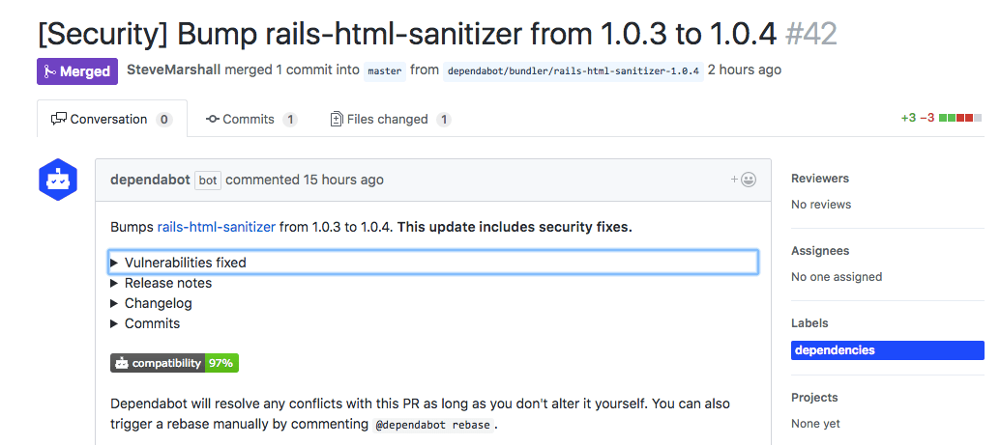

GitHub announced the [GitHub Security Advisory API][github-announcement] today
at GitHub Universe. Dependabot now uses it to pull in additional security
vulnerability details, and to respond to new security advisories instantly.

  

Dependabot has been using GitHub's vulnerability alerts database as a source
since [July][github-security-alerts-original], but the new Security Alerts API
gives us more data and makes the information available to us in real time.
That means you can now expect a Dependabot PR to fix any security
vulnerabilities seconds after they're published to GitHub's database.

We've got more security news coming soon - stay tuned, and stay safe out there!

🕵️‍♀️

[github-announcement]: https://blog.github.com/category/announcements/#github-security-advisory-api
[automatically-respond-to-security-advisories]: ../automatically-respond-to-security-advisories
[github-security-alerts-original]: ../github-security-alerts
